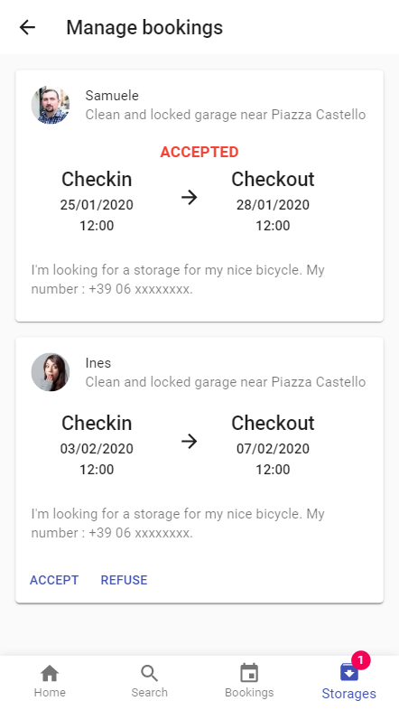

# iCycle

## Screenshots

## Prototype usage
### Prerequisites
- [MongoDB server](https://www.mongodb.com/download-center/community) installed (make sure it is in your %PATH% env. variable if you are running Windows)
- [npm](https://www.npmjs.com/get-npm)

### Launch
1. Run `npm install` in both src/backend/ and src/frontend/
1. Run `npm run start` in src/backend/
2. Run `npm run start` in src/frontend/
3. Browse http://localhost:3001/ to test the app!
